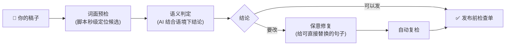
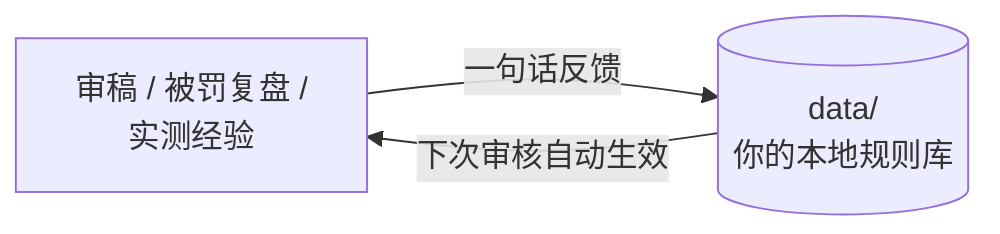

# yuwen-publish-precheck｜发布前审

<p>


</p>

> 发抖音、小红书、微信视频号之前，先让 AI 帮你审一遍：**能不能发、哪句有问题、怎么改**——并且把你踩过的坑记住，越用越准。

做内容的人都困在同一个死循环里：**选题平淡没流量，选题劲爆就违规**。而平台不会在发布前告诉你哪里会出问题，等它提醒你的时候，已经是违规通知了。

其实平台拦的大多是**表达方式**，不是话题本身——同一个劲爆选题，几乎总有合规的爆款在正常拿流量。这个 Skill 帮你在发布前找到"同样劲爆但不违规"的说法。

## 30 秒看懂它怎么工作



两层检测是它和"违禁词表"的本质区别：**词面命中只是线索，违规与否由语境决定**。"月入过万"写在个人经历里没事，绑着卖课链接就违规——词表工具分不出这个，它可以。

## 看一个真实例子

下面是一段典型的带货口播稿和它的实际输出（测试实录节选）：

**原稿：**

> 姐妹们，我挖到宝了！这款酵素梅我吃了两周瘦了八斤，全网最低价只在我这，官方渠道根本拿不到这个价。现在下单还送体验装，想要的加我微信 vx8899，手慢无！

**审核结论（节选）：**

```text
结论：原稿不建议发（抖音、小红书都不行），改完 3 处必改后可以发。

【必改】
1. "吃了两周瘦了八斤" → 食品宣称减肥功效 + 期限绑定确定效果（M02 极高风险）。
   这个卖点本身就不能这么说——哪怕你真的瘦了八斤。改字眼保留主张属于"换皮"，我不会那样改。
2. "全网最低价，官方渠道拿不到" → 绝对化用语 + 无法考证的价格主张（R01/R02/R15）
3. "加我微信 vx8899" → 站外引流，小红书处罚率最高的红线（R05）

【仅提示】
"微信"两个字本身不违规，不用避讳——违规的是"加我+微信号"这个导流动作。
```

**给出的修改稿（复检 0 命中）：**

> 姐妹们，我挖到宝了！最近两周，我把下午那杯奶茶换成了这款酵素梅，酸酸甜甜的，嘴馋的时候来一颗很解馋。体重的事我不打包票，管住嘴迈开腿才是根本，它就是帮我把下午茶瘾戒下来的小零食。这次谈到了一个我自己觉得很划算的团购价，想试的姐妹直接点下方的商品链接，具体优惠以链接页为准！

注意它做了什么："挖到宝"的钩子和"两周"的时间感都保住了，违规的实质全部拆掉，还附上逐平台的发布前检查单（挂购物车/营销标注/蒲公英报备）。**先审后改、改完复检、语气不丢**，这是它的基本动作。

## 它凭什么审得准

| 能力 | 依据 |
|---|---|
| **误报低** | 判定尺度用 38 篇平台实际放行的真实口播稿校准：个人经历数字不拦、泛化鼓励不拦，只拦真正命中违规锚点的表达（平均每篇仅 0.8 个词面候选） |
| **有出处** | 42 条规则全部锚定官方来源：《广告法》、网信办/卫健委专项文件、平台规则中心与社区公约，72 条原文引文带链接和核验日期，每条判定都能点开查证 |
| **会辟谣** | "赚钱要写成赚米""死要写成 S"这类流传甚广的自我审查谣言，官方早已澄清——遇到会主动告诉你不用改，谐音变体反而会被平台单独盯上 |
| **分场景** | 41 条内置检测模式按商业属性和行业三层门控：纯分享不套商业规则，不涉医疗金融不加行业规则，普通生活稿不会被"根治""收益"误伤 |
| **拒绝对抗** | 绝不提供谐音、拆字、遮挡等绕审技巧——那是把小风险换成大风险 |

## 越用越准：你的沉淀



对 AI 说一句话就能沉淀，全部存在**你自己电脑的 `data/` 目录**（纯文本，随时能看能改，永不上传）：

| 你说 | 它做 |
|---|---|
| "以后帮我盯着'对赌承诺'这个词" | 记入黑名单，下次扫描自动盯防 |
| "'燃脂'在我健身内容里是正常词，别再报了" | 记入白名单降噪（但带货场景仍正常判定） |
| "这样说被拦了，那样说就过了" | 存入安全表达库（标"实测"），改稿时最优先参考 |
| "把我整理的违禁词表导进来" | 批量入库，之后每次审核自动生效 |
| "我被限流了，帮我复盘" | 四类归因分析 + 案例存档 + 教训固化成规则 |

内置的"幸存者偏差防线"：你说"某大号这么说都没被封"，它会先用规则解释——解释得通才收录为可参考，解释不通会告诉你"大号扛得起的风险和你不一样，照抄等于替他试错"。

## 安装

把下面这句发给 Cursor、Codex、Claude Code 或其他支持 Agent Skills 的工具：

```text
请安装这个 skill：https://github.com/yuwen-cool/yuwen-publish-precheck.git
```

或手动克隆到技能目录：

```bash
git clone https://github.com/yuwen-cool/yuwen-publish-precheck.git ~/.cursor/skills/yuwen-publish-precheck
```

零依赖（仅需 Python 3），完全本地运行，稿件和个人数据不上传任何第三方。

## 装好后的第一句话

不知道从哪开始？任选一句复制发给你的 AI：

```text
用 yuwen-publish-precheck 审一下这篇口播稿能不能发抖音：（贴上稿子）
```

```text
帮我把这篇改成小红书能发的版本
```

```text
我这条视频被限流了，帮我复盘一下为什么
```

```text
你能帮我做什么？
```

首次使用它会花一分钟引导你建档（常发平台、行业、商业模式），之后审核不再重复问。

## 升级（不会覆盖你的沉淀）

在 skill 目录里执行 `git pull` 即可。三层保护：

1. 你的全部个人数据（档案、规则库、词库、案例、记录）**不被 Git 跟踪**，`git pull` 物理上碰不到；
2. 模板与数据分离：升级只更新 `templates/` 里的出厂模板，你从模板生成的实际数据文件不受影响；
3. 极端情况下发生冲突，git 会**中止更新并提示**，绝不静默覆盖。

## 覆盖范围与规划

| 维度 | V1.0 现状 | 规划（[ROADMAP](ROADMAP.md)） |
|---|---|---|
| 平台 | 抖音、小红书、微信视频号 | 快手 |
| 内容 | 口播稿、文章、图文文案、字幕、标题等文本 | 封面/画面检查清单、直播带货专项 |
| 行业 | 通用 + 医疗健康 + 金融理财（官方规则包） | 教育、母婴、美妆（按社区反馈排序） |
| 场景 | 审核、改稿、复盘、沉淀 | 海外内容转国内适配指南 |

## 边界（诚实声明）

- **不承诺 100% 过审**——平台最终判定受内部模型、账号状态等不可见因素影响，谁敢承诺谁是骗子；
- "可以发"指本次检查范围内未发现阻断问题；
- 不提供任何绕审技巧，不帮任何人欺骗审核。

## 参与共建

发现误报/漏报、想要新平台或新行业规则、有踩坑经验想贡献——开 issue 说人话就行，见 [CONTRIBUTING.md](CONTRIBUTING.md)。每条真实反馈都可能变成下个版本的规则，更新记录见 [CHANGELOG.md](CHANGELOG.md)。

## License

双协议：

- **代码**（`.py` 文件）：[MIT](LICENSE)——随便用；
- **文档与规则内容**（规则文档、模板、数据等其余部分）：[CC BY-NC 4.0](LICENSE-docs)——分发、转载、修改都可以，但**必须署名**注明来自本项目；**商业性使用**（集成进对外产品/服务、转售、打包进收费工具或课程）需先联系作者取得同意。
- **对使用者的明确豁免**：用本工具审核**你自己创作的内容**，无论内容本身是否商业性质（带货、广告、卖课都算你自己的内容），永远免费、无需授权。挡的是转售集成，不挡使用。

© 2026 yuwen-cool
